## Изучите [README.md](./README-правка.md) файл и структуру проекта.

# Задание 1

1. Спроектированная контейнерная To Be архитектура онлайн-кинотеатра в нотации C4 доступна для ознакомления по [ссылке](https://www.planttext.com?text=nLf9Rzj65BxhLqnpgOtQrg4zzLGlRReaXMkdxJ6WHCOXAee2ITarYW29LSSfRCH5UcZH9Ls0tYNPYcL5Llu2-O_wtfiXPqWEjNX1aSG9XxDyxtlhFEO3Fp2yeEdKIc_PzMgjQLhiOH0q_FVBPS_OMTgoWuVDIjEtlAfR3wnwi5HrdNAZPjHnpQ8Vc3MxKbvzRt4TXxwyUwVi67vWUJ1qVnLM67RTyfOQk7_fRHR-53sEMk4R-DMdV_N28OE7KVWwEWhFuEzks8xsOFWr_3bdy3WCUz4J76BH4pvr68wY7wAZw3bRSPjrq_1sI_4_vX3eRSzjDXROhV1FxRvzs0XEfpt3ONHuQvvzLs9itV9yjquR5AwDZXWyNi0cxV0yl5WC1s4V7aVq5kP4ZyFshQkjdYyz8g9UXc_WkHUUqifZJjG9Je4b_UXfr09oG11aAIrFQNCN5E3SJpXP1HKund9br_SHszzoSjYUZ8Y5l_B1i0E3Pm3e0c4IPum1qZzWSGVMF6O4kG-xZS9NC1TmeWgrsesEQNbY8VTJ6lp8g5hcSgD1UCVlly00qGW58hkwY0wZ_Q8pdoUmbPFdTgmA78KdlO1P7TqfFQxK_FW28usSqSyE4OVwGRPw20paPF9TT0WwGvk6OnR33hu0q6TWu8znUW5H32oMtft1ACuuZfv7Fy2x7eSAmgCcILjzlX0jRO2QfJtW9-1iqUGsJC0TQ0fV_Jq9HVRL5sCmmWyx1LlPutRx1gq4MKOkFZMsZSsgPpU21RPX6TK0x3RBg-DMx9ebgFsTxATFyWbsD3IpEQDkUgvjbctNBrj1TVxwYByWOmUkBeXUOIX35HSVUXd-lSJ8WnF2GKDxXKRr_sdXerepW53xJjq8x6rBemBVWT1-xokX0msD2LKj02_a_oTySRsiypKOUQC3XUJieJEIteqE-KlOGZ3PfLHnXF7m3KmRe3BIU3253E5Ss15swcDoGNOn-C5smuo-CDSKylo8ViP1y7VOP23C0DsvIq7si2Z8LOpgDrRTtBIyRRjgPSFSKBSPoi_n3K4woW9XNnlGZ8PzsmYi7MCNzbrks6oBFv5M_m8EdsHp2n8DciByGW5fWDc5LATcbbPYchquviQMpBSu9GCbbQ35yfn7pFOOQVMC_EqLfHXStKT8guPfxfO_S-jRYGNd3JdmBCEnwrk2CLZsjLNnNM0nI8dt8oA68_V9WHBJxCBHRTBtYAG-f-Exv09nMQ79rx0PPiIXDbXnsuXXxERTRwsImxssWY3_JT8uaKOkn4aQJO02hXArADcXUB4KRVGW9OyZhWtBj7t0b0MLJhHhhWEZivhX0YFNHtSxWCCn6o4ov5XrjrOnjSIUj5rLrHAMDE8lOOoPD9ZIzejednGAfegH1nmM00qmq7UvDQ9_Nn061TWudNDW9GqkenaybDQt34_Cvuy4vQKaX3i3aa46Sq8qjXZvpGdt9qhzJz63on38k13jmWe03xZjGdqjFIJnaInr4YAHDX4YUGfQO9mHggvdALP9fbL8bXQPwW2apPpHPyuOQ_d7qJwUikxwmPPdRNvnPpm7VhFYKs5YktN9nQOoodogZyTGCfK9o-WGrsUdTAl1mJOVnD_47xbDXoWMeGz2vf27lx7qQQIPCeGeO0eBOWo41Tm-6XCu6iQk0nV1cuyTL1HXNhg0jSHfGSn88P9XOvqFNtVaqC7IHOmTerQp0YLZqVCKKQC3Jw_v_hF51DLqKgTFDXfXpAUNDHYjCq8AgeBLA1oiYP4fMC2usS782TLUnZ84r54uYAlEyNZ74fK1UPDK5Pikt7WDqr9izW4DZA57r64YtfpnNegEB0Rr85P04EAZPoJIVggkcqXGx5sJYC4pHLC2ZzWJCx7o6c2o6nFAnuKRfraBR0VA6UE68qvrvhk1FXfb0Sk0T3TvS-tLpAp8TRRekDksvKjdlKlFbwWXg0J_7lL2Ts8gT2Wp5Q14I5cKFJR7ByNWMSFei2pKsiVO28_Ysdo0VP3vYIQSaanZo3cyUCFipuRt5Z5MttBrv9gU8zMl1CIDknCB4b9-Xz-r4exv9JTwkfGfraGyX7Law7GBxmkShsdzW7fbxQGNGmr4E43S9fGgPLA5efZwX_MgQrBhL35oYm-MJOl-dh5W9apIpWUYfEBLpGcDOS2bSKe4SMaDUGFRmx7TzMdY2Kr6QRLQRMVrsPviL8cWApMtahEfOe_iPI9dbs6lWAvqmt96whY_CcHqNJtbThRvxcBLTHf6O5Tg5lC3rpEsBBtTLSrwabnMrpuNYMLMLQZt_S4OpuXjK378BcK5cNv0Oi2HObS3smEJWQnZ6bZw9W9igAEN4oNN3vBGg9UEMPLtML26KzmbwokoVpugg2_o0dtHj9fMMgexxXP2_Wt1wPsuhUbcd6lyGicZycT9Sxwr3ObyfIc-0mn4KqOad6Uyh4r1IRv7l4WfKF_5uSDlWpbGBM-bo-ddgEz4ffmbQToEvgSh5X6OJYb8WoS3CENK5AzyF8K2IezZLRLyg-Gc5pEWgfP_oBdQ3YcCeemgGfS4wPEuES3P8j9au_TG0slgfVFyqnBCnG3_ZESId8Jol89YibLutqXkjBbE67zNsh1gukEP_A3o2oKfiHzMgDJHrNnUcLUMfxuRN6g7TDjxXYscO4SlFJ8ZIZd24LEGQiM2rhHTo0GJ1CgFxzrRVsSdRcqAgHH6hcT3bQ2hxpYHDS4CcK_g2modBYbj-MMQ4AgeDCtVQN1cXLQtr3KPfvLTirr1_-4AEnRV8MRObEiwnvwsAKtzOlR0zHo3T5gWL4LNOpvOed9Rl1HZzBqzNG0CCz_W5Rrh59Dkl6wihyPqgUFfrgUSb1fFcf7ywbbmdhw3ABVKlYzgrCcJjCkAOATaKvFsdrIuO1hgoEyk59LREC9h71eLDVqXLcYyNVIPyU0RGwgu4DGDdJU5HQKwQoF-hVoobgJtoMnFJbAkdv_lOCaLcRsodPp2YVdEdBIIt7cwxfISdZbJxTJ8IPdZRz2SSkXlyAoCwAcJhcN7NBtsbxoK2KDKArBgetq5DQZhiUNrJz9xnfkaaYr6wPdSGz_voJLthk8rXNadsnkIrbsufA3ZCSLAzSuwnVI2kw9ScCQURmPHsoPZobhmkIl_vhlfPPg6oCGrYhHZvwxOE5ihRC7zX_ytj1ProUBE75s9u_-oKj2fwuTdO-x5-QjFzbwCjvJO5sQ6Bwx5YXFBEmtOxG4tTNuDFQ2Rwe1o1KeZsohqTIthvHo2mhUuhVwCZ13y8r6axf641mLjeQne6YExXdYafUgA-vPA7y2EJQVs7m00).
Если коротко, то имеется 3 основных домена:
1. работа с пользовательской информацией
2. работа с финансовой частью
3. работа с мультимедией
Все 3 домена объеденены сквозной шиной данных, через которую можно обмениваться изменениями домены.

# Задание 2

### 1. Proxy
В рамках задания был реализован proxy сервис, который выступает своего рода API Gateway. В рамках сервиса, была немного переделана логика настройки проксирования запросов. Добавление новых правил для проксирования декларируются в рамках переменных окружения:
1. 'PROXY_RULE_{1,2,3,...,n}_MAPPING' - который отвечает за добавление нового правила проксирования и имеет формат:  "/api/movies -> http://movies-service:8081", где до разделителя " -> " указывается регулярка для проверки URL, который нужно проксировать, а уже после разделителя указывается адрес, куда нужно проксировать трафик.
2. PROXY_RULE_1_PERCENT: "50" - который отвечает за сплитование трафика между маппингом и fallback сервером. Значение 0 приводит к проксированию всех запросов на монолит, а 100 - все запросы уходят на проксируемый урл.
P.S. в идеале, нужно унести эту конфигурацию в какой-то внешний yml/json файл, в котором удобней будет настраивать проксирование и прочие вещи, но для простоты MVP этим было решено пожертвовать. Считаем эту доработку, как feature request.

### 2. Kafka
Необходимый сервис для отправки и обработки событий был разрабоан в рамках директории /microservices/events.
Необходимая конфигурация в proxy сервисе была доработана для доступа к этмоу сервису, а именно прописан новый роут для проксирования.
Прогон postman тестов можно посмотреть в рамках 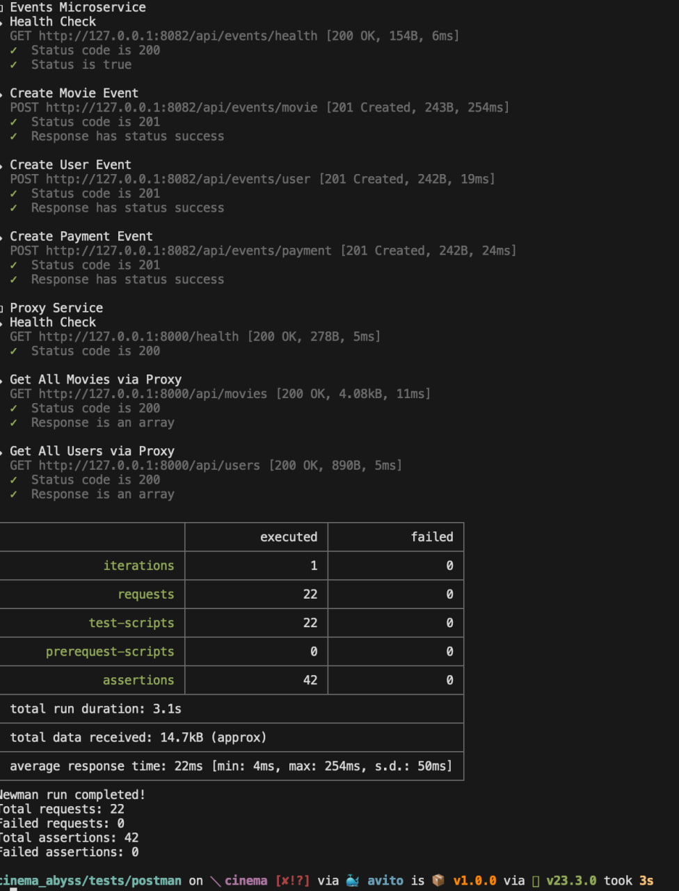.
Результаты в kafka UI в рамках 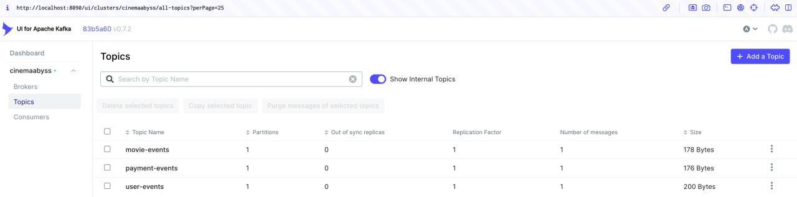 и информацию о топике movie 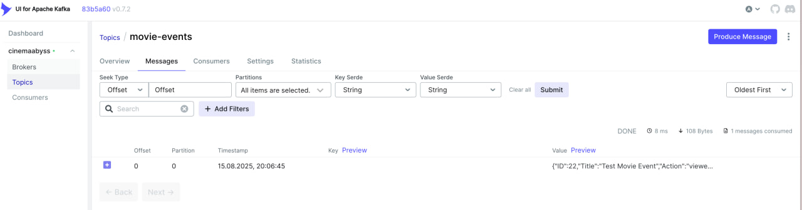
Часть лога по обработке событий врамках 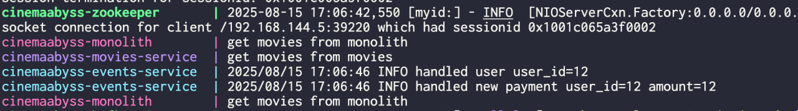

# Задание 3

### CI/CD

В рамках задания как и требовалось, был доработан CI/CD процесс сборки контейнеров 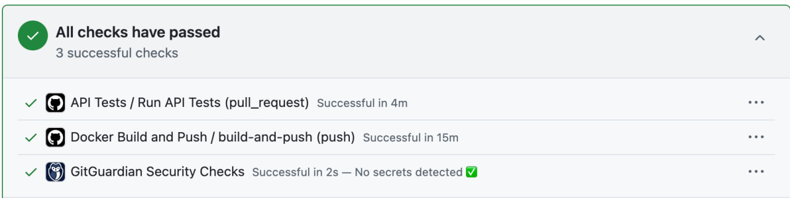. Пример зеленых тестов 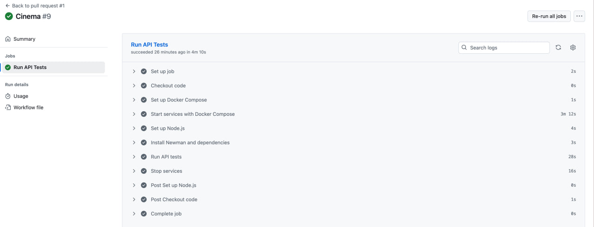 и зеленой сборки контейнеров 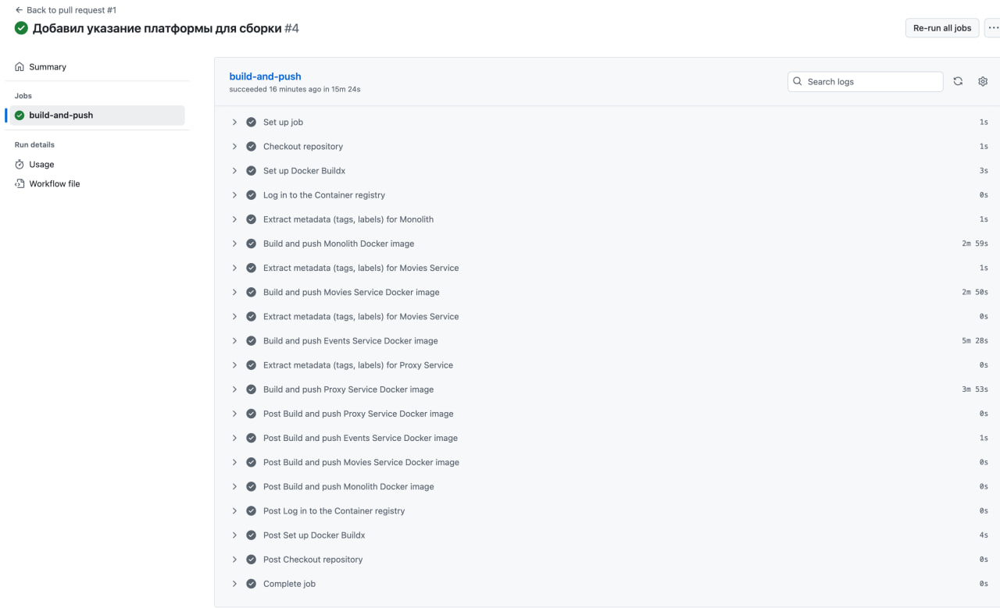

### Proxy в Kubernetes

Полностью настроенная и функционирующая инфраструктура cinemaabyss представлена на скриншоте 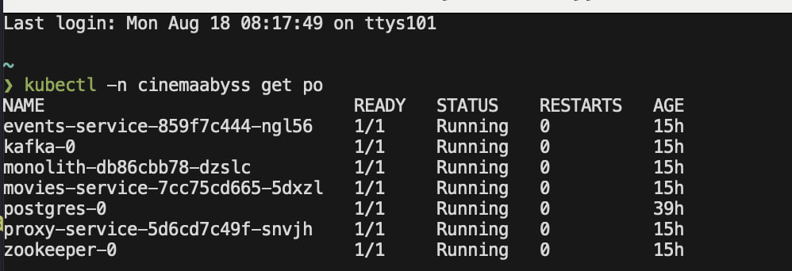.
Для доказательста работоспособности решения, был сделан вызов https://cinemaabyss.example.com/api/movies с уже настроенным ingress controller, котоырй можно увидеть на скриншоте 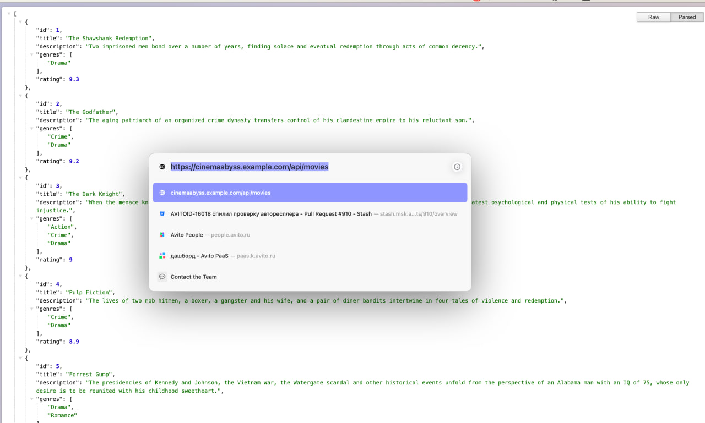.
Успешынй прогон postman тестов на kubernetes кластере + обработка событий events можно увидеть на скриншоте 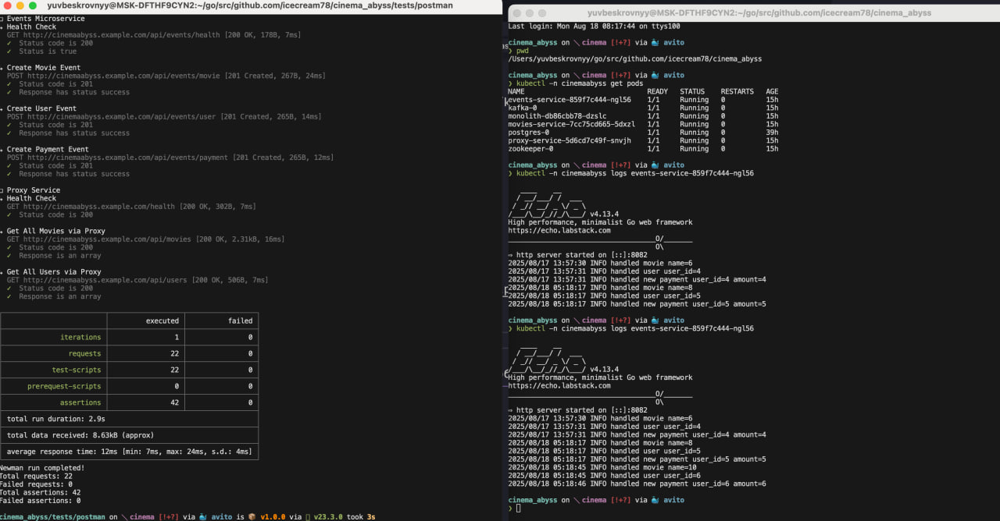

# Задание 4
Доработанный helm-чарт исходя из реалий работы cinemaabyss можно наблать в директории /src/kubernetes. Результат запуска этого чарта можно увидеть на 2-х сприншотах 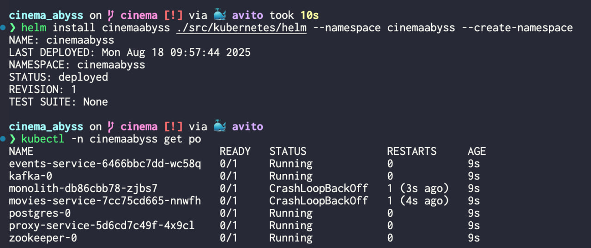 и 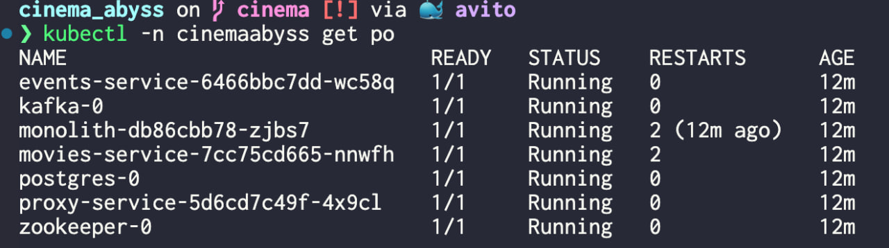. В рамках первого скриншота случлось несколько ретраев при создании сервисов, но это прошло.
Для контрольной проверки работы решения был вызван адрес https://cinemaabyss.example.com/api/movies, который успешно открылся и вывел информациюю о доступных фильмах 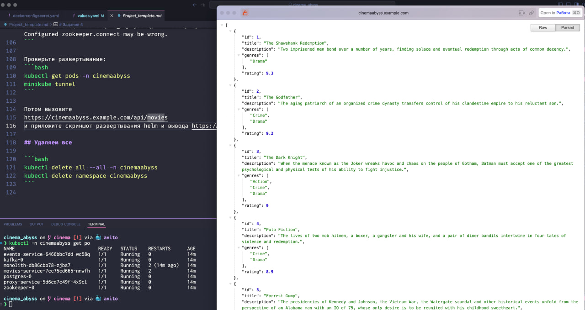

